# Scaling GPU processing on AWS using docker
GPU instance time required to run machine learning tasks is an expensive resource and there is a need to scale it when loads are changing. [Docker](https://www.docker.com/products/docker-engine) facilitates a deployment of application code. [nvidia-docker](https://github.com/NVIDIA/nvidia-docker) enables docker to use GPU in containers. 

This guide describes a solution which can scale up machine learning prediction capacity when there is a load and reduce it to zero when there is none, and the required steps to setup required infrastructure.

## Solution
It consists of following parts:
* S3 bucket - a bucket to upload images to be processed
* SQS queue - a queue to send messages from S3 to gpu  
* ECS cluster - a cluster which groups container instances
* Docker image - a docker image (able to use GPU) containing an image processing worker code and available from ECR
* ECS task definition - a task definition to run the worker docker image  
* EC2 instance - a GPU instance that runs an ECS task
* Autoscaling group - an EC2 autoscaling group that manages EC2 instance number using autoscaling policies
* Cloudwatch alert - an alert configured to invoke autoscaling policies based on number of messages in SQS queue
* Custom AMI - a customized AMI to run nvidia-docker

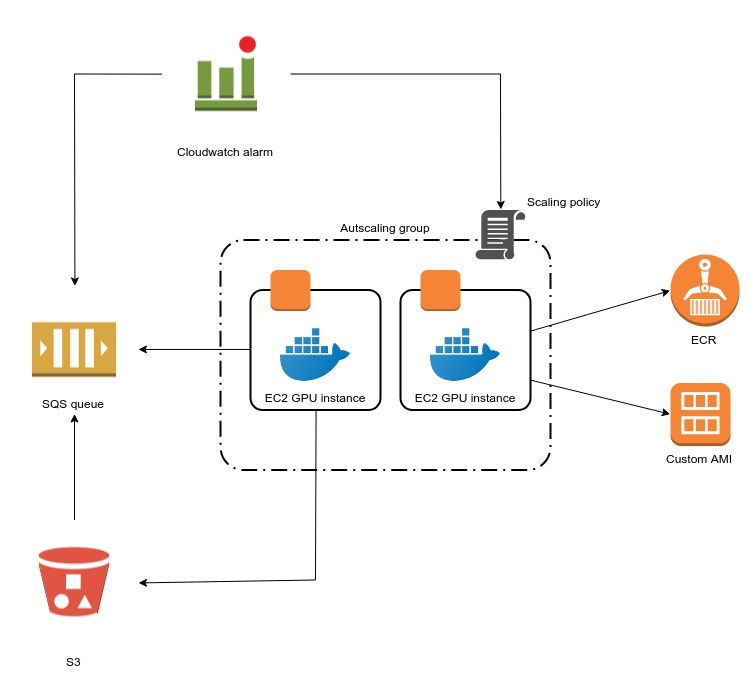

Images to be processed are uploaded to S3 bucket. The S3 bucket is configured to notify an SQS queue on new images uploaded. A Cloudwatch alert reads a message number in the SQS queue and launches autoscaling actions of an autoscaling policy when the number of messages is changed. The autoscaling group launches or terminates EC2 instances according step scaling policies. Each EC2 instance uses a customized AMI which has Nvidia CUDA drivers and nvidia-docker and registers into a AWS ECS cluster. An ECS task from a definition in the cluster is launched - a docker container with the application code is loaded from ECR registry and started. The application reads  messages from the queue and processes the images from S3 until the queue is empty and the autoscaling group stops all EC2 instances.

## Configuration
### Create SQS queue
Enter queue name and leave default settings


Add permissions to push messages from S3:
1. Edit the created queue
2. Set Principal to Everybody 
3. Select action SendMessage
4. Add condition (Qualifier - ```None```, Condition - ```ArnLike```, Key - ```aws:SourceArn```, value - ```arn:aws:s3:*:*:your-bucket```)


### Create S3 bucket and setup SQS notification
Setup S3 Events to send messages to the created SQS queue on put objects:

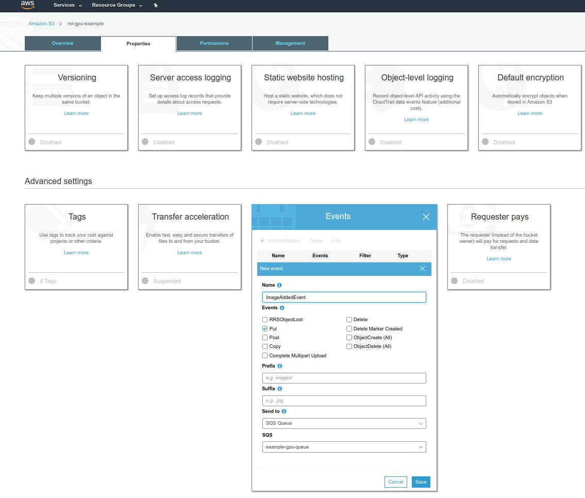

### Create custom nvidia-docker2 AMI
1. From EC2 console select and launch Deep learning base AMI (version 12):

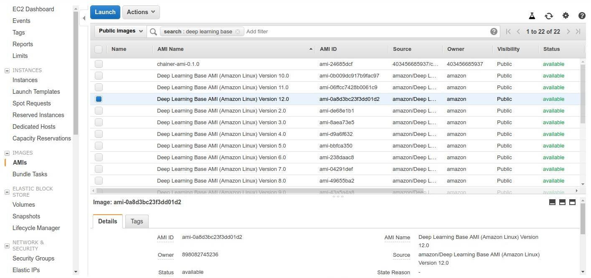

2. Select GPU compute instance type (p2.xlarge):

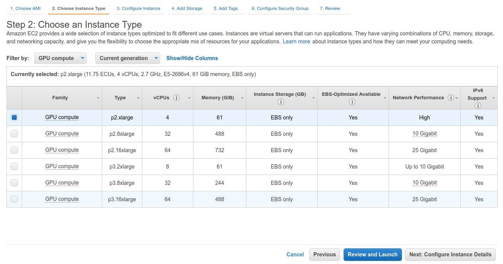

3. Configure additional settings and launch. Select ssh key or create a new one when asked.
4. Connect to the launched as ec2-user instance using SSH.
5. Base deep learning has Cuda drivers and nvidia-docker2 installed, bus has no ECS agent, therefore it has to be installed by executing
```sudo yum install -y ecs-init```
6. To verify nvidia-docker working, run: 
    
    ``` CUDA_VERSION=$(cat /usr/local/cuda/version.txt | awk '{ print $3 }' | cut -f1-2 -d".")```  
    
    and 
    
    ```sudo docker run --privileged --runtime=nvidia --rm nvidia/cuda:$CUDA_VERSION-base nvidia-smi```
    
    The result should look like this:

    
7. Remove docker containers:

    ```sudo docker rm $(sudo docker ps -aq)```

8. Remove docker images:

    ```sudo docker rmi $(sudo docker images -q)```
9. Create a new AMI from the running instance.

### Setup docker repository 
You can skip this section, if you already have a docker repository or use docker image from a public repo.

Select ECS from AWS console and create repository for your docker image.

### Create docker image

Build a docker image which uses GPU for Tensorflow.
```
FROM tensorflow/tensorflow:1.11.0-gpu-py3

RUN pip install boto3

WORKDIR /app
COPY src/worker.py ./
CMD ["python","worker.py"]
```
Add code to read messages from SQS queue and process images:
```python
from keras.applications.resnet50 import ResNet50
from keras.preprocessing import image
from keras.applications.resnet50 import preprocess_input, decode_predictions
import numpy as np

import boto3
import json
import os

model = ResNet50(weights='imagenet')
bucket = boto3.resource('s3').Bucket('ml-gpu-example')
queue = boto3.resource('sqs').get_queue_by_name(QueueName='example-gpu-queue')

def processImage(file):
  bucket.download_file(file, file)
  
  img = image.load_img(file, target_size=(224,224))
  x = image.img_to_array(img)
  x = np.expand_dims(x, axis=0)
  x = preprocess_input(x)
  preds = model.predict(x)
  print('Predicted:', decode_predictions(preds, top=3)[0])
 
  os.remove(file)

def startWorker():
  while True:
    for message in queue.receive_messages(VisibilityTimeout=8000, MaxNumberOfMessages=10):
      key = json.loads(message.body)['Records'][0]['s3']['object']['key']
      processImage(key)
      message.delete()

startWorker()

```
Build docker image and push it to the docker repository:

```
#!/bin/bash

IMAGE_NAME=ml-gpu-example
REGISTRY_URL=XXXXXXXXXXXX.dkr.ecr.eu-central-1.amazonaws.com

docker build -t $IMAGE_NAME . 
docker tag $IMAGE_NAME $REGISTRY_URL/$IMAGE_NAME
docker push $REGISTRY_URL/$IMAGE_NAME
```

### Setup ECS task

#### 1.  Create role for the ECS task
Select trusted entity type  Elastic Container Service Task in the first step

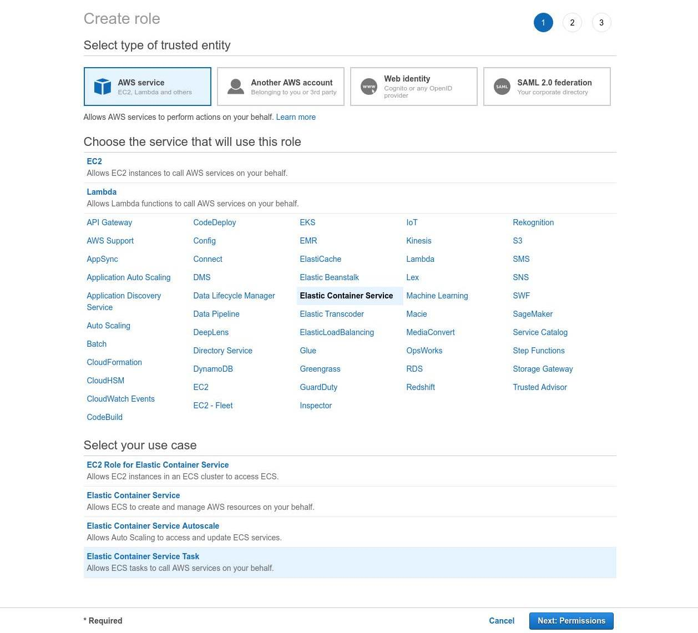

Add policies:
* AmazonEC2ContainerRegistryReadOnly
* AmazonS3ReadOnlyAccess
* CloudWatchLogsFullAccess
* AWSLambdaSQSQueueExecutionRole

The result should look similar to this:

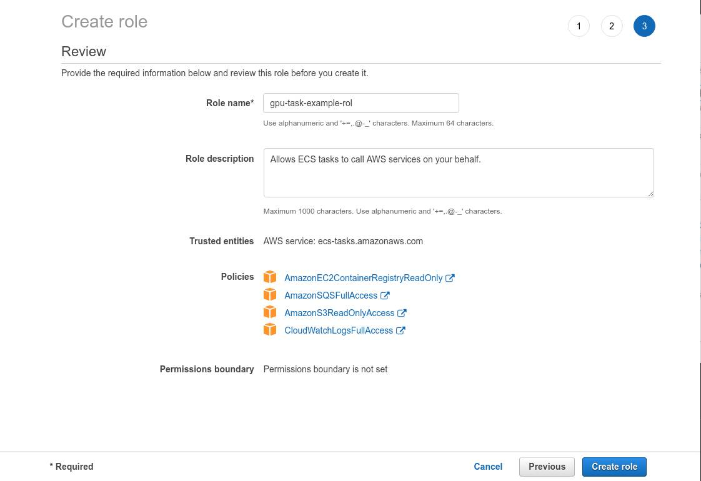


#### 2. Create new Task Definition
Name your task definition, select the role you created earlier, set cpu and memory limits. As we will be using one docker container per EC2 instance, we can put limits at capacity of p2.xlarge instance: 48000 MB and 4096 CPU.


Select Edit container and set following fields:
* Container name - gpu-worker-container (any name of your choosing)
* Image - xxxxxxxxxxxxxxxx.dkr.ecr.eu-central-1.amazonaws.com/ml-gpu-example
* Memory Limits (MiB) - Hard limit/48000 (available memory from p2.xlarge)
* CPU units - 4096
* Essential - true
* Entry point - python3,worker.py


#### 3. Create new ECS cluster
For simplicity reasons we will create a new empty cluster which will use default VPC


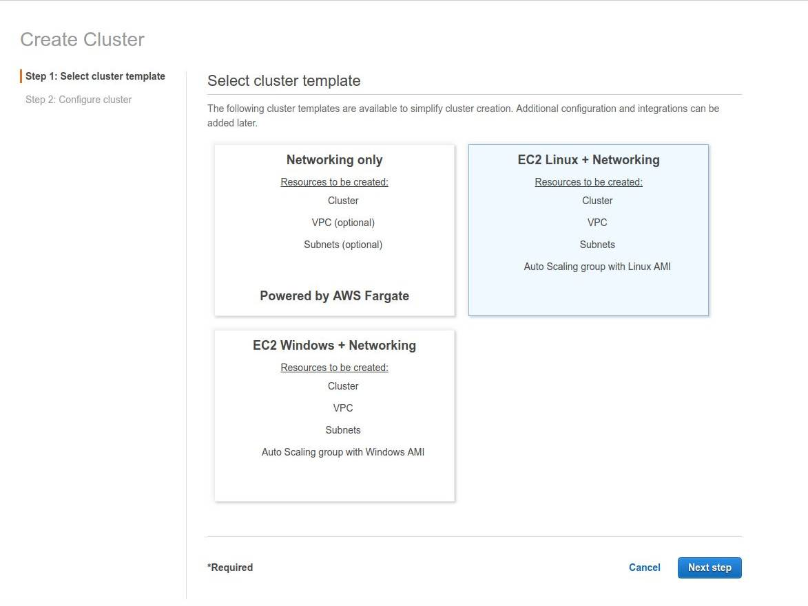

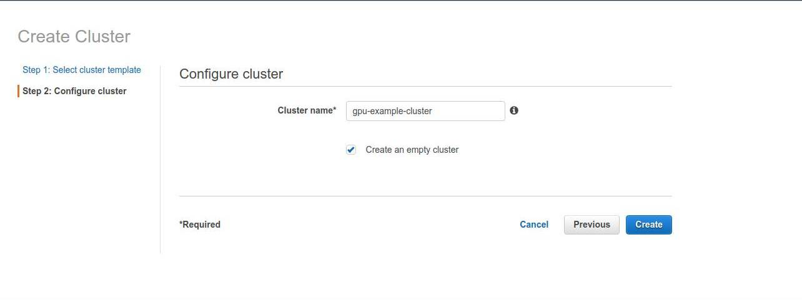

#### 4. Create service in the cluster

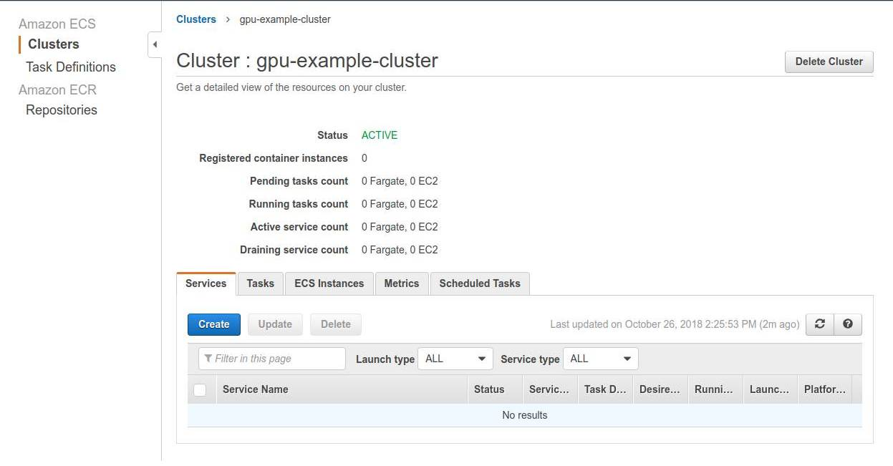


**Configure service:** 

Set following properties:
* Launch type - EC2
* Task Definition - your task definition created earlier
* Cluster - your cluster
* Service name - your service name
* Service type - DAEMON

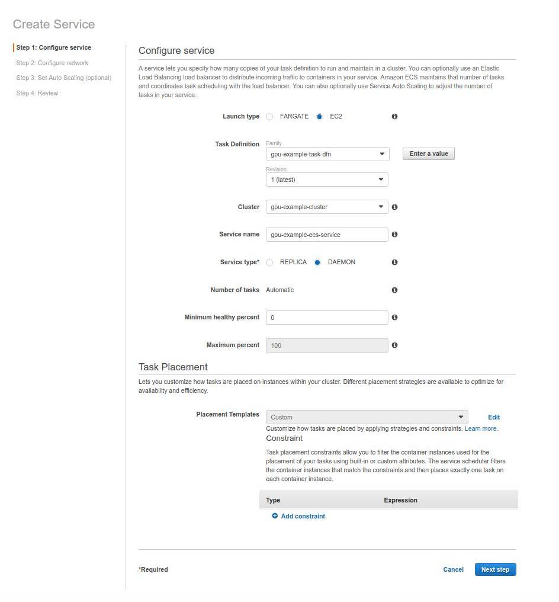
**Configure network:**

Leave Load balancer type None

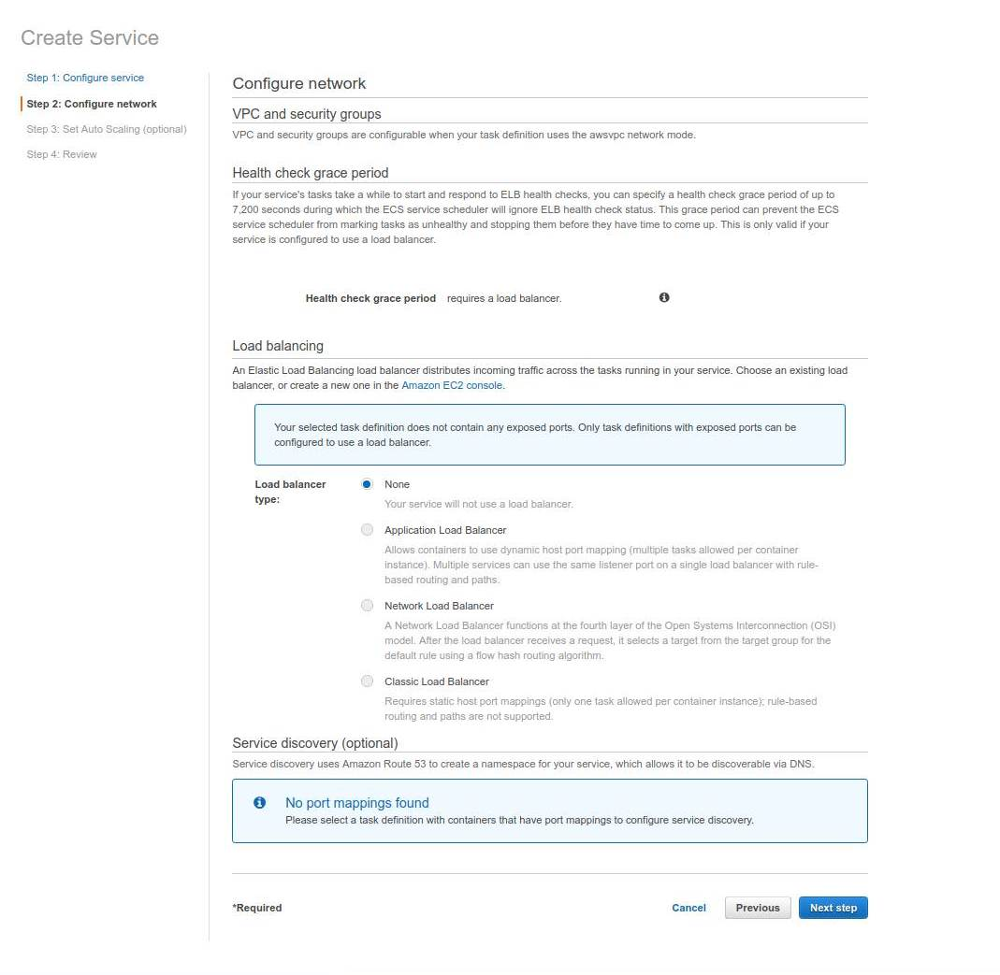

**Set Autoscaling (optional)**

Leave autoscaling as is:

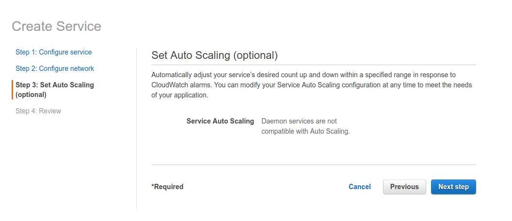

### Create role for EC2
Create a role for EC2 instances to access various services required for ECS. 

Select **Select Container Service** as a service and as a use case: 

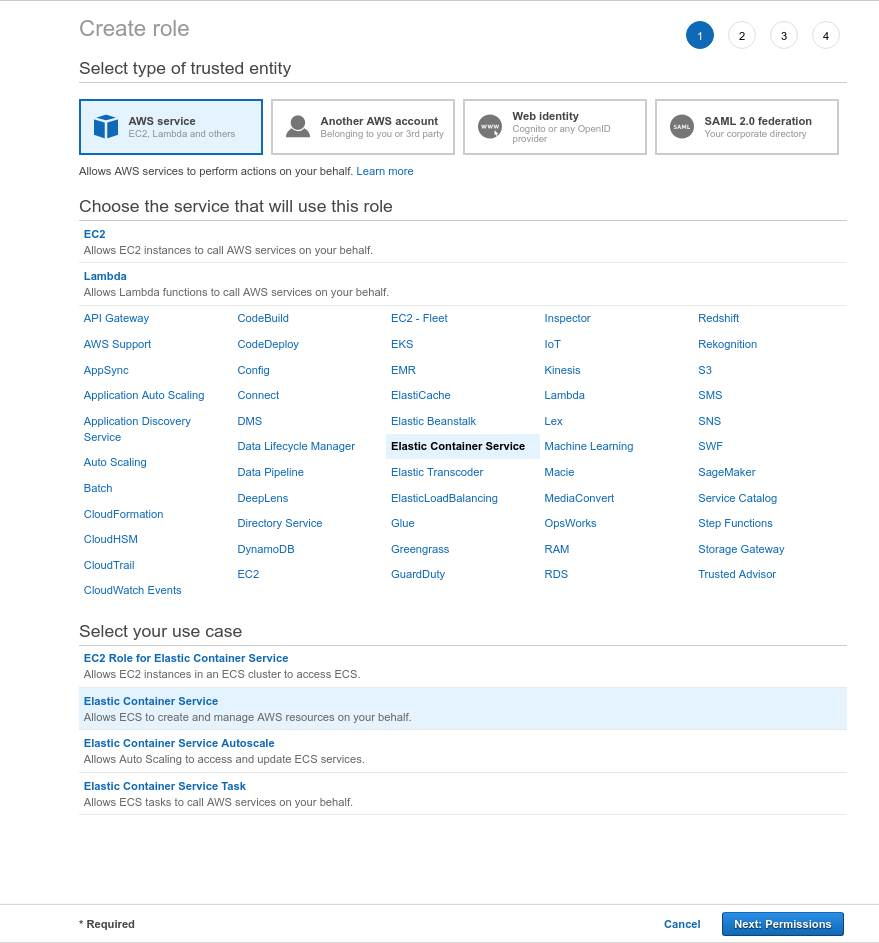 

Use default supplied policy **AmazonEC2ContainerServiceRole**:

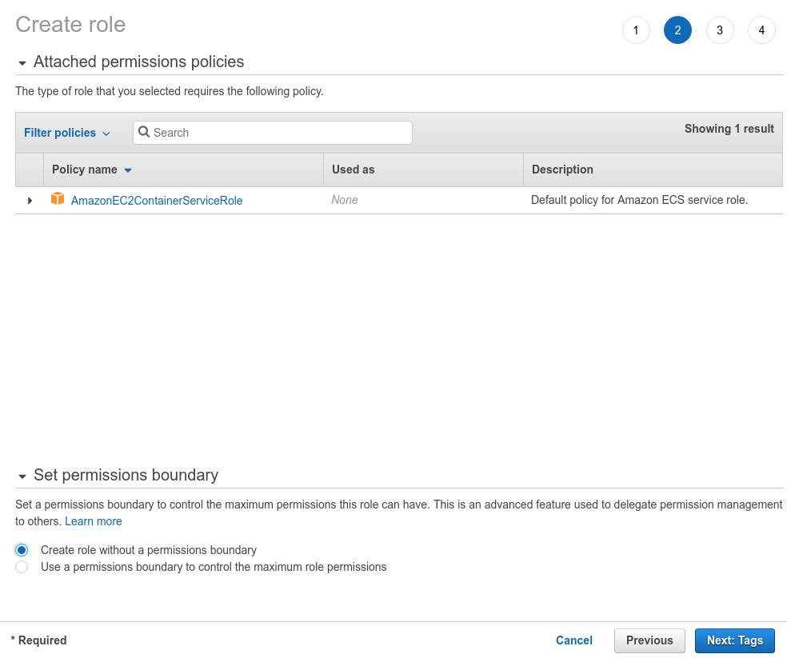 

Add name for the role and save.

### Create launch template
Set properties:
* Launch template name: ml-gpu-example
* AMI ID: select your created AMI
* Instance type: p2.xlarge
* User data:

```
#!/bin/bash
echo ECS_CLUSTER=gpu-example-cluster >> /etc/ecs/ecs.config;echo ECS_BACKEND_HOST= >> /etc/ecs/ecs.config;
```

### Create Cloud Watch Alarm
Click **Create Alarm** button from Cloud Watch console.
Select metric *ApproximateNumberOfMessagesVisible* for SQS queue you have created earlier (example-gpu-queue), which would be active when there are messages in the queue. Set name, remove default actions and create the alarm.


### Create EC2 Autoscaling group

Select autoscaling groups from EC2 console and click **Create Auto Scaling Group**. Select the option to create an autoscaling group from Launch Template and select the template created earlier (gpu-example-template).

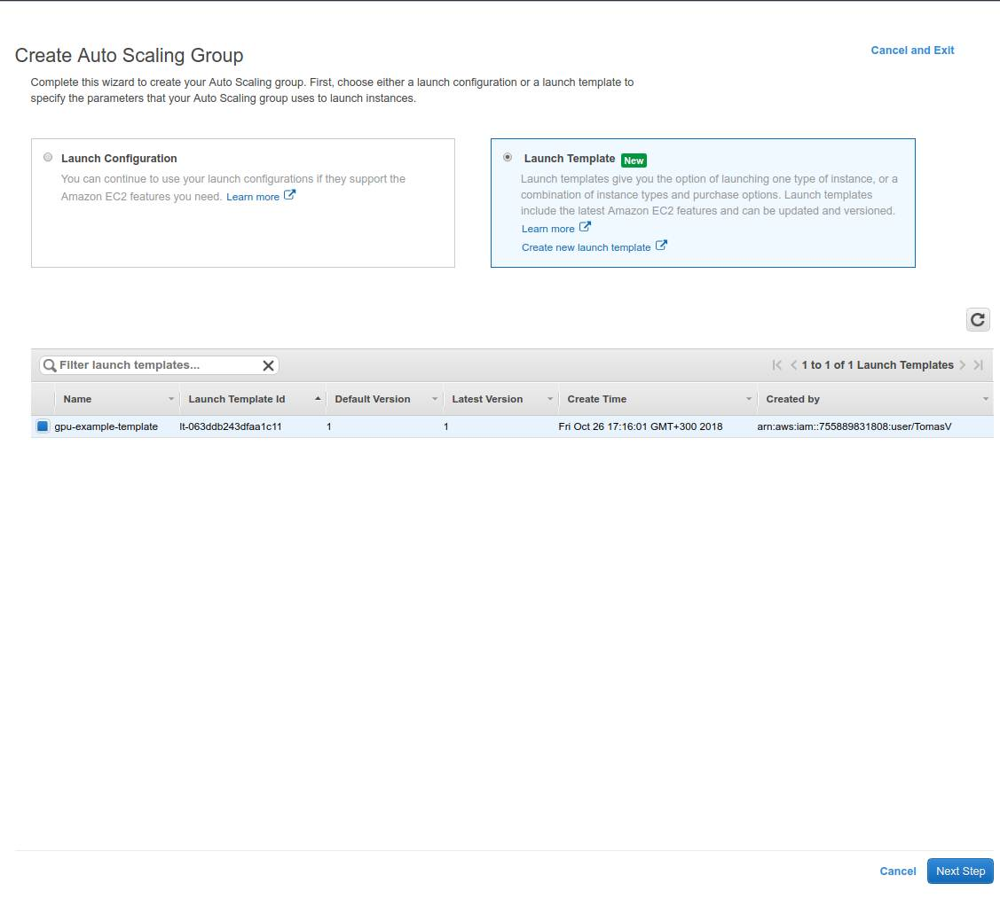

Set name and select subnets for EC2 instances and go to the next step: Configure scaling policies.

Use a step scaling policy to set size of the autoscaling group. One policy is enough if an instance number is set, not increased. Select the Cloudwatch alarm created earlier and define steps for setting number of instances based on number of messages in the queue.

The example policy sets the scaling group size to 1 instance when there is at least 1 message in the message queue and to 2 when the number of messages in the queue is over 100. All instances are removed when there are no messages in the queue.

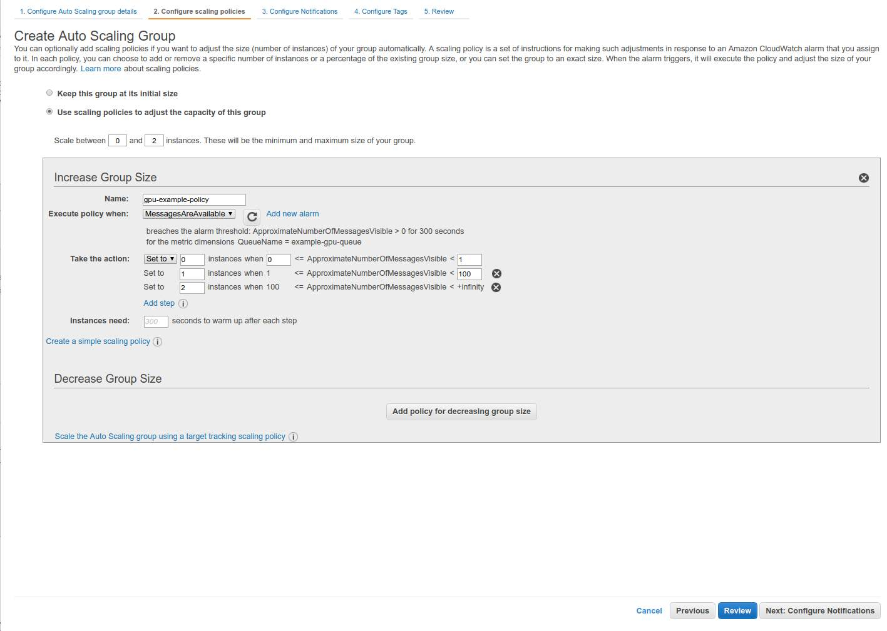

### Update Cloudwatch alarms to trigger downscaling
The autoscaling policy created earlier is invoked by the Cloudwatch alarm only when it's value is in OK state (>0). We need to invoke the policy when the alarm is in ALARM state (is 0). We need to add another autoscaling action when the alarm is in ALARM state:
